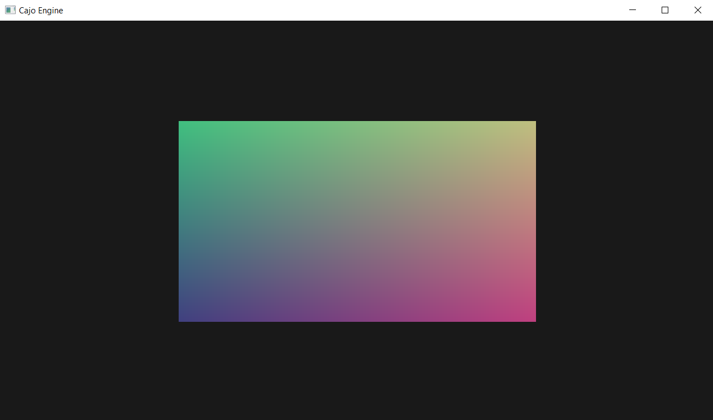
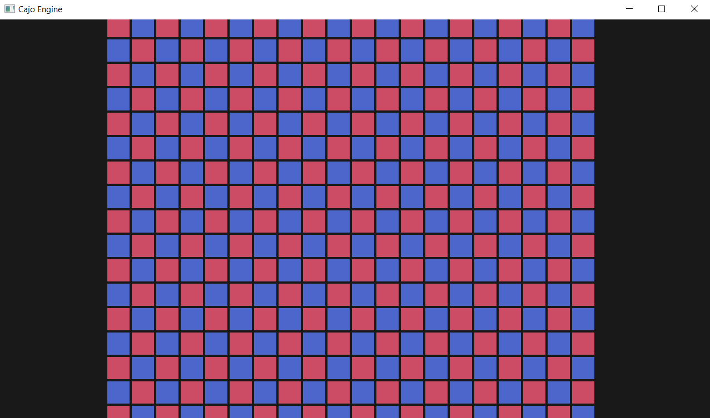
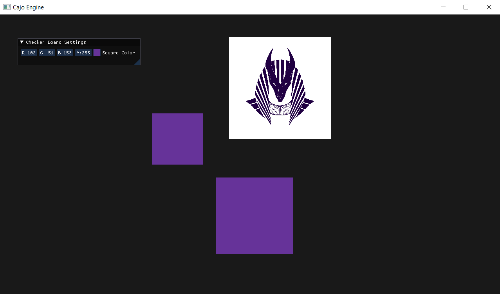
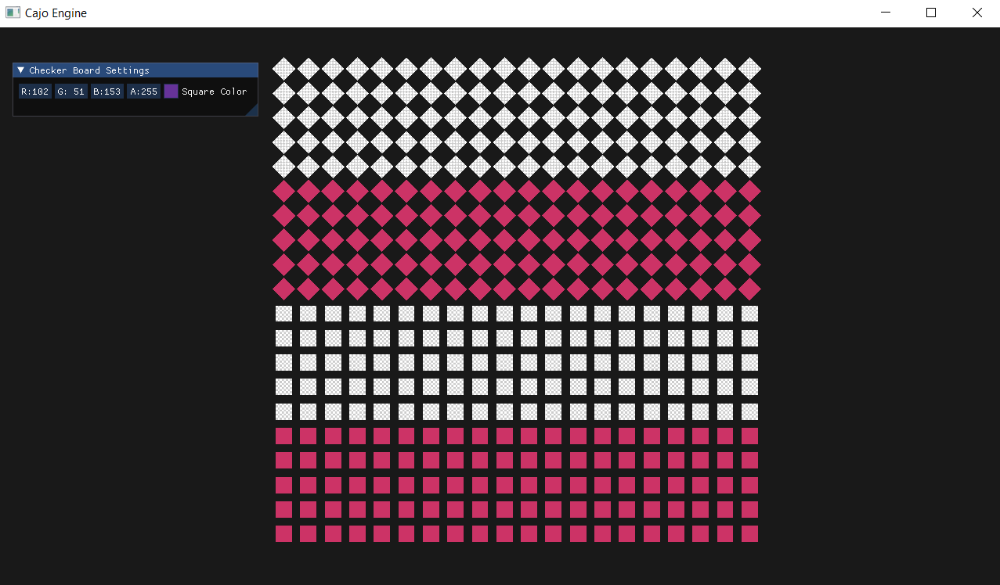

# Cajo

 Game Engine فتّاك. Well, trying to make a one.. 😂   

### Supported Features
- Event system
- Layer stack
- Platform agnostic Renderer API. Only, OpenGL API specific implementation is supported
- Orthographic camera   

### Photos
- First rectangle using shaders

  

- Checker board

  

- Renderer - Bitmap Test

  

- Renderer - Batch Test

  

